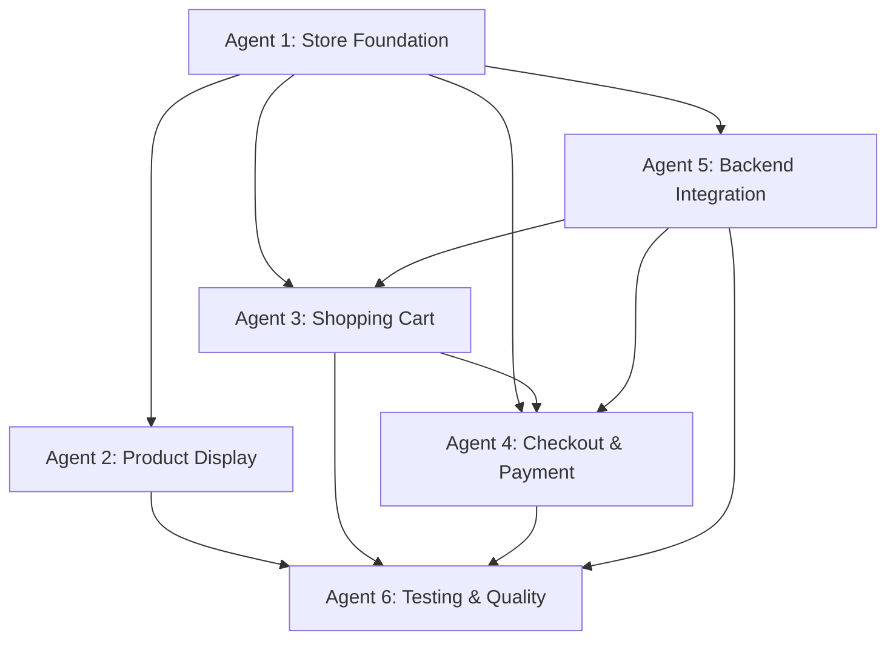

# Store Development Agent Division Plan

## Overview
This document divides the comprehensive store development project into 6 specialized agents, each responsible for distinct areas of the store implementation. Each agent can work independently while maintaining clear interfaces between their components.

---

## 🏪 Agent 1: Store Foundation Agent
**Focus**: Core infrastructure and product catalog

### Responsibilities
- Create main store page structure and routing
- Implement product catalog system
- Set up product data management
- Create base store types and interfaces

### Deliverables
```
📁 Components to Create:
├── pages/StorePage.tsx              # Main store page container
├── types/store.ts                   # Store-specific type definitions
└── atoms/
    ├── PriceTag.tsx                # Standardized pricing display
    ├── ServiceBadge.tsx            # AI/Professional indicators
    └── DeliveryTime.tsx            # Timeframe indicators

📁 Stores to Create:
├── useStoreStore.ts                # Products catalog and management
└── stores/index.ts                 # Export new stores
```

### Technical Requirements
```typescript
// Store product structure
interface Product {
  id: string;
  name: string;
  category: 'ai-service' | 'professional-service' | 'package';
  price: number;
  currency: 'AUD';
  description: string;
  shortDescription: string;
  features: string[];
  deliveryTime: string;
  originalPrice?: number; // For package deals
  savings?: number;
  active: boolean;
  metadata: {
    isPackage: boolean;
    includedServices?: string[];
    isFree: boolean;
  };
}

// Products data (hardcoded initially)
const STORE_PRODUCTS: Product[] = [
  {
    id: 'ai-resume-review',
    name: 'AI Resume Review',
    category: 'ai-service',
    price: 0,
    currency: 'AUD',
    description: 'Get instant automated analysis of your resume...',
    shortDescription: 'Instant automated resume analysis',
    features: [
      'Instant automated analysis',
      'ATS compatibility score', 
      'Basic improvement suggestions',
      'Immediate PDF report download'
    ],
    deliveryTime: 'Instant',
    // ... more products
  }
];
```

### Design System Integration
- Use existing UI components from `components/ui/`
- Follow color scheme: AI services (`bg-pill-bg`, `text-pill-text`), Professional (`bg-secondary`)
- Implement responsive grid: 3-col desktop, 2-col tablet, 1-col mobile

### Dependencies
- None (foundational layer)

---

## 🛍️ Agent 2: Product Display Agent
**Focus**: Product cards, grid layout, and service comparison

### Responsibilities
- Create individual product card components
- Implement product grid layout with filtering
- Build service comparison functionality
- Handle product recommendations logic

### Deliverables
```
📁 Components to Create:
├── molecules/
│   ├── ProductCard.tsx            # Individual service card
│   └── ServiceComparison.tsx     # AI vs Professional comparison
└── organisms/
    └── ProductGrid.tsx           # Products layout container
```

### Technical Requirements
```tsx
// ProductCard component interface
interface ProductCardProps {
  product: Product;
  onAddToCart: (product: Product) => void;
  onCompare?: (product: Product) => void;
  featured?: boolean;
  showSavings?: boolean;
}

// ProductGrid filtering and sorting
interface ProductGridProps {
  products: Product[];
  filters: {
    category?: string[];
    priceRange?: [number, number];
    deliveryTime?: string[];
  };
  sortBy: 'price' | 'name' | 'deliveryTime';
  onProductSelect: (product: Product) => void;
}

// Service comparison matrix
const COMPARISON_FEATURES = [
  'Delivery Time',
  'Price',
  'Quality Level', 
  'Revision Rounds',
  'Personal Consultation',
  'Industry Expertise'
];
```

### Design Patterns
```tsx
// Product card structure following design system
<Card className="rounded-lg border bg-card shadow-sm hover:shadow-lg transition-shadow">
  <CardHeader className="flex flex-col space-y-1.5 p-6">
    <div className="flex justify-between items-start">
      <ServiceBadge type={product.category} />
      <PriceTag 
        amount={product.price} 
        currency="AUD" 
        strikethrough={product.originalPrice}
        savings={product.savings}
      />
    </div>
    <CardTitle className="text-2xl font-semibold">{product.name}</CardTitle>
    <CardDescription className="text-sm text-muted-foreground">
      {product.shortDescription}
    </CardDescription>
  </CardHeader>
  <CardContent className="p-6 pt-0">
    <ul className="space-y-2 text-sm">
      {product.features.map(feature => (
        <li key={feature} className="flex items-start">
          <span className="text-green-500 mr-2">✓</span>
          {feature}
        </li>
      ))}
    </ul>
    <DeliveryTime time={product.deliveryTime} />
  </CardContent>
  <CardFooter className="flex items-center p-6 pt-0">
    <Button 
      variant="default" 
      className="w-full" 
      onClick={() => onAddToCart(product)}
    >
      {product.price === 0 ? 'Get Free Review' : 'Add to Cart'}
    </Button>
  </CardFooter>
</Card>
```

### Dependencies
- Requires Agent 1 (Store Foundation) to be completed
- Uses atoms: PriceTag, ServiceBadge, DeliveryTime

---

## 🛒 Agent 3: Shopping Cart Agent ✅ COMPLETED
**Focus**: Cart functionality and state management

### Responsibilities
- ✅ Implement shopping cart state management
- ✅ Create cart UI components
- ✅ Handle cart persistence and conflict resolution
- ✅ Implement smart recommendations

### Deliverables
```
📁 Components Created:
├── molecules/
│   ├── ShoppingCart.tsx           # Cart sidebar/modal ✅
│   └── CartSummary.tsx           # Cart totals and checkout ✅
└── atoms/
    └── CartIcon.tsx              # Cart indicator with item count ✅

📁 Stores Created:
└── useCartStore.ts               # Shopping cart state ✅
```

### Technical Requirements
```typescript
// Cart state interface
interface CartItem {
  id: string;
  productId: string;
  name: string;
  price: number;
  category: 'ai-service' | 'professional-service' | 'package';
  quantity: number;
  deliveryTime: string;
  conflictsWith?: string[]; // Other product IDs that conflict
}

interface CartState {
  items: CartItem[];
  subtotal: number;
  gst: number; // 10% GST for Australia
  total: number;
  promoCode?: string;
  promoDiscount: number;
  isOpen: boolean;
  
  // Actions
  addItem: (product: Product) => void;
  removeItem: (itemId: string) => void;
  updateQuantity: (itemId: string, quantity: number) => void;
  clearCart: () => void;
  applyPromoCode: (code: string) => Promise<void>;
  removePromoCode: () => void;
  toggleCart: () => void;
  
  // Smart features
  getRecommendations: () => Product[];
  resolveConflicts: (newItem: Product) => void;
  calculateTotals: () => void;
}
```

### Smart Cart Features
```typescript
// Package deal recommendations
const getPackageRecommendations = (cartItems: CartItem[]): Product[] => {
  const hasResume = cartItems.some(item => 
    item.name.toLowerCase().includes('resume') && 
    item.category === 'professional-service'
  );
  const hasCoverLetter = cartItems.some(item => 
    item.name.toLowerCase().includes('cover letter') && 
    item.category === 'professional-service'
  );
  
  if (hasResume && hasCoverLetter) {
    return []; // Already has both
  }
  if (hasResume || hasCoverLetter) {
    return [STORE_PRODUCTS.find(p => p.id === 'professional-package')];
  }
  return [];
};

// Conflict resolution (e.g., individual + package)
const resolveConflicts = (existingItems: CartItem[], newItem: Product): CartItem[] => {
  if (newItem.metadata.isPackage) {
    // Remove individual services that are included in package
    return existingItems.filter(item => 
      !newItem.metadata.includedServices?.includes(item.productId)
    );
  }
  return existingItems;
};
```

### Persistent Storage
```typescript
// LocalStorage integration
const CART_STORAGE_KEY = 'ausjobs-cart';

const persistCart = (cartState: CartState) => {
  localStorage.setItem(CART_STORAGE_KEY, JSON.stringify({
    items: cartState.items,
    promoCode: cartState.promoCode,
    promoDiscount: cartState.promoDiscount
  }));
};

const loadPersistedCart = (): Partial<CartState> => {
  const stored = localStorage.getItem(CART_STORAGE_KEY);
  return stored ? JSON.parse(stored) : {};
};
```

### Dependencies
- Requires Agent 1 (Store Foundation) for product types
- Independent of other agents

---

## 💳 Agent 4: Checkout & Payment Agent  
**Focus**: Multi-step checkout process and payment integration

### Responsibilities
- Create multi-step checkout workflow
- Handle free service processing
- Integrate with existing PaymentForm component
- Implement order confirmation system

### Deliverables
```
📁 Components to Create:
├── organisms/
│   └── CheckoutForm.tsx          # Multi-step checkout process
├── molecules/
│   ├── CheckoutStepper.tsx       # Progress indicator
│   ├── UserDetailsForm.tsx       # Customer info collection
│   ├── OrderSummary.tsx          # Final order review
│   └── OrderConfirmation.tsx     # Success page
└── pages/
    └── CheckoutPage.tsx          # Full checkout page

📁 Stores to Create:
├── useOrderStore.ts              # Order history and tracking
└── usePaymentStore.ts            # Payment processing state
```

### Technical Requirements
```typescript
// Checkout process state
enum CheckoutStep {
  CART_REVIEW = 'cart-review',
  USER_DETAILS = 'user-details',
  PAYMENT = 'payment', 
  CONFIRMATION = 'confirmation'
}

interface CheckoutState {
  currentStep: CheckoutStep;
  customerDetails: {
    email: string;
    firstName: string;
    lastName: string;
    phone?: string;
  };
  serviceRequirements: {
    resumeFile?: File;
    jobPostingUrl?: string;
    targetRole?: string;
    industry?: string;
    additionalNotes?: string;
  };
  paymentMethod?: string;
  orderId?: string;
  
  // Actions
  setStep: (step: CheckoutStep) => void;
  updateCustomerDetails: (details: Partial<CustomerDetails>) => void;
  updateServiceRequirements: (requirements: Partial<ServiceRequirements>) => void;
  createOrder: () => Promise<string>;
  processPayment: (paymentDetails: any) => Promise<boolean>;
  processFreService: (serviceId: string) => Promise<void>;
}

// Order structure
interface Order {
  id: string;
  userId?: string;
  customerEmail: string;
  items: CartItem[];
  status: 'pending' | 'paid' | 'processing' | 'completed' | 'failed';
  paymentIntentId?: string;
  serviceRequirements: ServiceRequirements;
  createdAt: Date;
  completedAt?: Date;
  total: number;
}
```

### Checkout Flow Implementation
```tsx
// Multi-step checkout component
const CheckoutForm = () => {
  const { currentStep, setStep } = usePaymentStore();
  const { items, total } = useCartStore();
  
  const renderStep = () => {
    switch (currentStep) {
      case CheckoutStep.CART_REVIEW:
        return <OrderSummary items={items} total={total} />;
      case CheckoutStep.USER_DETAILS:
        return <UserDetailsForm onNext={() => setStep(CheckoutStep.PAYMENT)} />;
      case CheckoutStep.PAYMENT:
        return <PaymentForm selectedPackage={{ price: total }} />;
      case CheckoutStep.CONFIRMATION:
        return <OrderConfirmation />;
      default:
        return null;
    }
  };

  return (
    <div className="max-w-4xl mx-auto p-6">
      <CheckoutStepper currentStep={currentStep} />
      {renderStep()}
    </div>
  );
};
```

### Free Service Handling
```typescript
// Special handling for free services
const processFreeService = async (product: Product) => {
  if (product.price === 0) {
    // Create order without payment
    const order = await createOrder({
      items: [{ productId: product.id, quantity: 1, price: 0 }],
      status: 'paid', // Skip payment for free services
      paymentMethod: 'free'
    });
    
    // Immediately trigger service delivery
    await triggerServiceDelivery(order.id, product.id);
    
    return order;
  }
};
```

### Dependencies
- Requires Agent 1 (Store Foundation) for product types
- Requires Agent 3 (Shopping Cart) for cart state
- Uses existing PaymentForm.tsx component

---

## 🌐 Agent 5: Backend Integration Agent
**Focus**: API integration and data management

### Responsibilities
- Create API service layer for store operations
- Implement backend endpoints integration
- Handle data synchronization
- Manage error handling and loading states

### Deliverables
```
📁 Services to Create:
├── services/
│   ├── storeApi.ts              # Store/products API calls
│   ├── orderApi.ts              # Orders and checkout API
│   ├── paymentApi.ts            # Payment processing API
│   └── serviceDeliveryApi.ts    # Service fulfillment API
├── hooks/
│   ├── useProducts.ts           # Product data fetching
│   ├── useOrders.ts             # Order management
│   └── usePayment.ts            # Payment processing
└── types/
    └── api.ts                   # API response types
```

### Technical Requirements
```typescript
// API service interfaces
interface StoreApiService {
  getProducts: () => Promise<Product[]>;
  getProduct: (id: string) => Promise<Product>;
  validatePromoCode: (code: string) => Promise<PromoCodeResponse>;
}

interface OrderApiService {
  createOrder: (orderData: CreateOrderRequest) => Promise<Order>;
  getOrderById: (orderId: string) => Promise<Order>;
  getUserOrders: (userId: string) => Promise<Order[]>;
  updateOrderStatus: (orderId: string, status: OrderStatus) => Promise<void>;
}

interface PaymentApiService {
  createPaymentIntent: (amount: number, orderId: string) => Promise<PaymentIntentResponse>;
  confirmPayment: (paymentIntentId: string) => Promise<PaymentConfirmationResponse>;
}

interface ServiceDeliveryApiService {
  processAIResumeReview: (orderId: string, resumeFile: File) => Promise<ReviewResult>;
  initiateAIResumeBuilding: (orderId: string, requirements: ResumeRequirements) => Promise<void>;
  bookProfessionalConsultation: (orderId: string, preferences: BookingPreferences) => Promise<BookingConfirmation>;
}
```

### API Integration Implementation
```typescript
// Store API service
export const storeApi: StoreApiService = {
  async getProducts() {
    const response = await httpClient.get('/api/store/products');
    return response.data;
  },

  async getProduct(id: string) {
    const response = await httpClient.get(`/api/store/products/${id}`);
    return response.data;
  },

  async validatePromoCode(code: string) {
    const response = await httpClient.post('/api/store/validate-promo', { code });
    return response.data;
  }
};

// Custom hooks for data management
export const useProducts = () => {
  const [products, setProducts] = useState<Product[]>([]);
  const [loading, setLoading] = useState(true);
  const [error, setError] = useState<string | null>(null);

  useEffect(() => {
    const fetchProducts = async () => {
      try {
        setLoading(true);
        const data = await storeApi.getProducts();
        setProducts(data);
      } catch (err) {
        setError(err instanceof Error ? err.message : 'Failed to fetch products');
      } finally {
        setLoading(false);
      }
    };

    fetchProducts();
  }, []);

  return { products, loading, error, refetch: fetchProducts };
};
```

### Error Handling & Loading States
```typescript
// Comprehensive error handling
interface ApiError {
  message: string;
  code?: string;
  field?: string;
}

const handleApiError = (error: any): ApiError => {
  if (error.response?.data) {
    return {
      message: error.response.data.message || 'An error occurred',
      code: error.response.data.code,
      field: error.response.data.field
    };
  }
  return { message: 'Network error occurred' };
};

// Loading state management
interface LoadingState {
  isLoading: boolean;
  loadingStates: Record<string, boolean>;
  setLoading: (key: string, loading: boolean) => void;
}
```

### Dependencies
- Requires Agent 1 (Store Foundation) for type definitions
- Uses existing httpClient.ts
- Independent API layer

---

## 🧪 Agent 6: Testing & Quality Agent
**Focus**: Comprehensive testing and quality assurance

### Responsibilities
- Create unit tests for all components and stores
- Implement E2E tests for critical user flows
- Set up performance testing
- Ensure accessibility compliance

### Deliverables
```
📁 Tests to Create:
├── components/
│   ├── atoms/__tests__/
│   │   ├── PriceTag.test.tsx
│   │   ├── ServiceBadge.test.tsx
│   │   └── DeliveryTime.test.tsx
│   ├── molecules/__tests__/
│   │   ├── ProductCard.test.tsx
│   │   ├── ShoppingCart.test.tsx
│   │   ├── CartSummary.test.tsx
│   │   └── ServiceComparison.test.tsx
│   ├── organisms/__tests__/
│   │   ├── ProductGrid.test.tsx
│   │   └── CheckoutForm.test.tsx
│   └── pages/__tests__/
│       └── StorePage.test.tsx
├── stores/__tests__/
│   ├── useStoreStore.test.ts
│   ├── useCartStore.test.ts
│   ├── useOrderStore.test.ts
│   └── usePaymentStore.test.ts
├── services/__tests__/
│   ├── storeApi.test.ts
│   ├── orderApi.test.ts
│   └── paymentApi.test.ts
└── e2e/
    ├── store-navigation.spec.ts
    ├── free-service-flow.spec.ts
    ├── paid-service-checkout.spec.ts
    ├── cart-functionality.spec.ts
    └── package-deal-flow.spec.ts
```

### Unit Testing Strategy
```typescript
// Component testing example
describe('ProductCard', () => {
  const mockProduct: Product = {
    id: 'test-product',
    name: 'Test Service',
    category: 'ai-service',
    price: 25,
    currency: 'AUD',
    description: 'Test description',
    shortDescription: 'Test short description',
    features: ['Feature 1', 'Feature 2'],
    deliveryTime: '1-2 hours',
    active: true,
    metadata: { isPackage: false, isFree: false }
  };

  it('displays product information correctly', () => {
    render(<ProductCard product={mockProduct} onAddToCart={jest.fn()} />);
    
    expect(screen.getByText('Test Service')).toBeInTheDocument();
    expect(screen.getByText('AU$25')).toBeInTheDocument();
    expect(screen.getByText('Feature 1')).toBeInTheDocument();
    expect(screen.getByText('1-2 hours')).toBeInTheDocument();
  });

  it('calls onAddToCart when button is clicked', () => {
    const mockAddToCart = jest.fn();
    render(<ProductCard product={mockProduct} onAddToCart={mockAddToCart} />);
    
    fireEvent.click(screen.getByRole('button', { name: /add to cart/i }));
    expect(mockAddToCart).toHaveBeenCalledWith(mockProduct);
  });
});

// Store testing example
describe('useCartStore', () => {
  beforeEach(() => {
    useCartStore.getState().clearCart();
  });

  it('adds item to cart correctly', () => {
    const { addItem } = useCartStore.getState();
    
    addItem(mockProduct);
    
    const { items } = useCartStore.getState();
    expect(items).toHaveLength(1);
    expect(items[0].productId).toBe('test-product');
  });

  it('calculates totals correctly with GST', () => {
    const { addItem } = useCartStore.getState();
    
    addItem(mockProduct);
    
    const { subtotal, gst, total } = useCartStore.getState();
    expect(subtotal).toBe(25);
    expect(gst).toBe(2.5); // 10% GST
    expect(total).toBe(27.5);
  });
});
```

### E2E Testing Strategy
```typescript
// Cypress E2E test example
describe('Store Checkout Flow', () => {
  it('completes free service flow', () => {
    cy.visit('/store');
    cy.get('[data-testid="ai-resume-review-card"]').should('be.visible');
    cy.get('[data-testid="ai-resume-review-card"] button').click();
    
    // Should bypass cart for free services
    cy.url().should('include', '/service/ai-resume-review');
    cy.get('input[type="file"]').selectFile('cypress/fixtures/sample-resume.pdf');
    cy.get('button[type="submit"]').click();
    
    cy.get('[data-testid="review-results"]').should('be.visible');
    cy.get('[data-testid="ats-score"]').should('exist');
  });

  it('completes paid service checkout flow', () => {
    cy.visit('/store');
    cy.get('[data-testid="ai-resume-building-card"] button').click();
    
    // Cart should open
    cy.get('[data-testid="shopping-cart"]').should('be.visible');
    cy.get('[data-testid="checkout-button"]').click();
    
    // User details step
    cy.get('input[name="email"]').type('test@example.com');
    cy.get('input[name="firstName"]').type('John');
    cy.get('input[name="lastName"]').type('Doe');
    cy.get('button[type="submit"]').click();
    
    // Payment step
    cy.get('iframe[name*="__privateStripeFrame"]').should('be.visible');
    // Payment testing would use Stripe test cards
  });
});
```

### Performance & Accessibility Testing
```typescript
// Performance testing setup
const performanceTest = () => {
  // Measure component render times
  // Check bundle size impact
  // Monitor memory usage
  // Test loading states
};

// Accessibility testing
const accessibilityTest = () => {
  // WCAG 2.1 AA compliance
  // Screen reader compatibility  
  // Keyboard navigation
  // Color contrast validation
};
```

### Dependencies
- Requires all other agents to be completed
- Tests integration between all components

---

## 🔄 Agent Coordination & Interfaces

### Inter-Agent Dependencies


### Shared Interfaces
```typescript
// Shared types that all agents must adhere to
export interface StoreAgentInterface {
  // Common product structure
  Product: Product;
  CartItem: CartItem;
  Order: Order;
  
  // Common event handlers
  onAddToCart: (product: Product) => void;
  onRemoveFromCart: (itemId: string) => void;
  onCheckout: () => void;
}
```

### Communication Protocols
1. **Type Definitions**: Agent 1 provides all shared types
2. **State Management**: Each agent manages its own Zustand store
3. **Component Props**: Standardized interfaces for component communication
4. **API Contracts**: Agent 5 defines all API interfaces
5. **Testing Standards**: Agent 6 provides testing templates and utilities

### Development Sequence
1. **Week 1**: Agent 1 (Foundation) - Must be completed first
2. **Week 2**: Agents 2, 3, 5 (Product Display, Cart, Backend) - Can work in parallel
3. **Week 3**: Agent 4 (Checkout & Payment) - Requires Agents 1, 3, 5
4. **Week 4**: Agent 6 (Testing) - Requires all other agents

### Quality Gates
- Each agent must pass unit tests before integration
- Components must follow established design system
- All TypeScript interfaces must be properly implemented
- Accessibility standards must be maintained
- Performance benchmarks must be met

This agent division ensures parallel development while maintaining code quality and system integration through well-defined interfaces and dependencies.